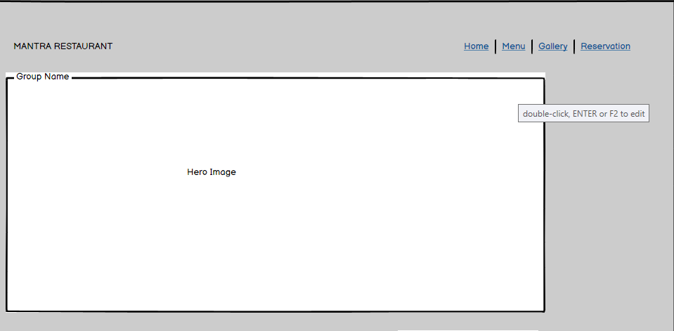
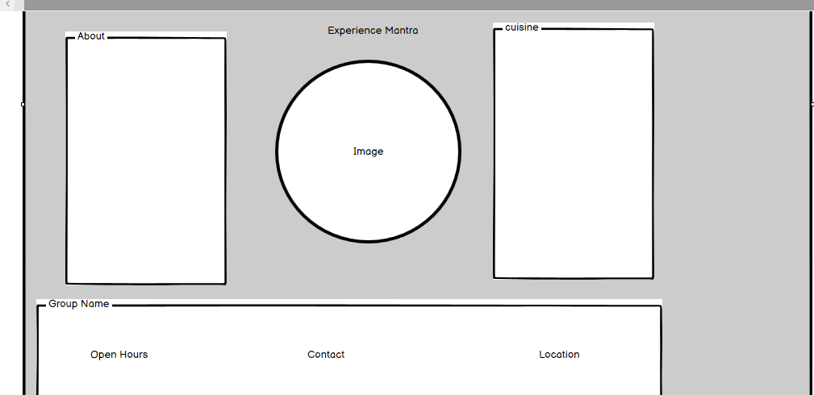
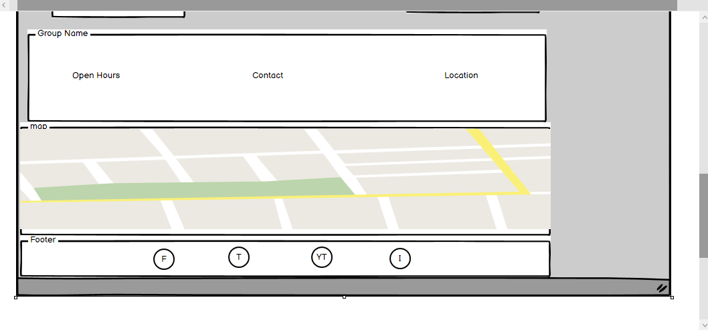
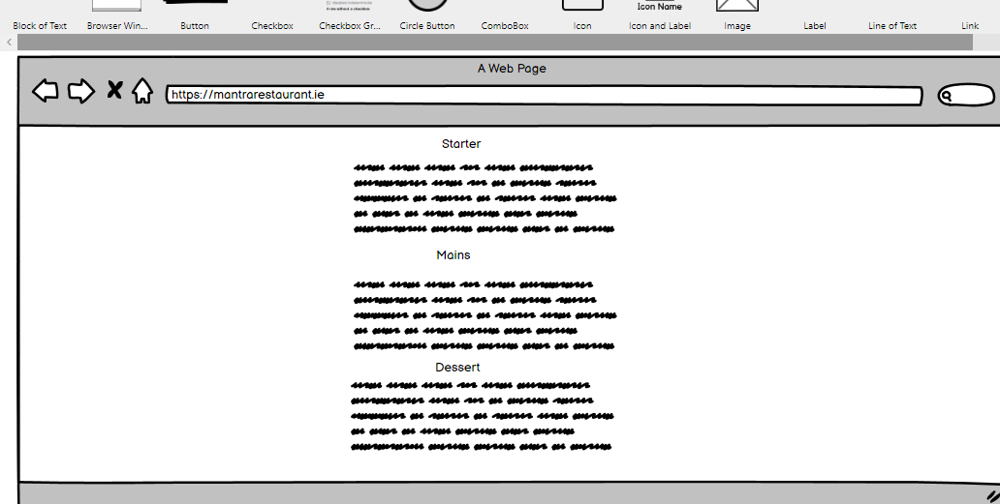
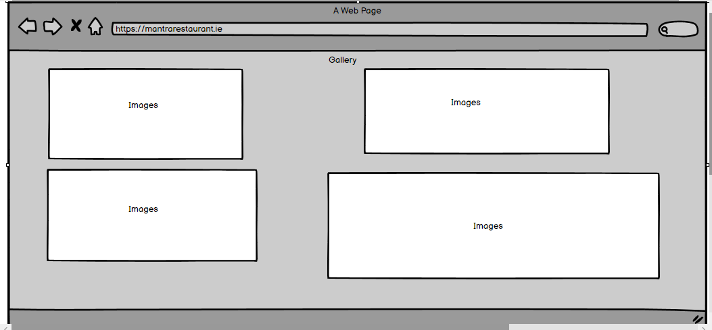
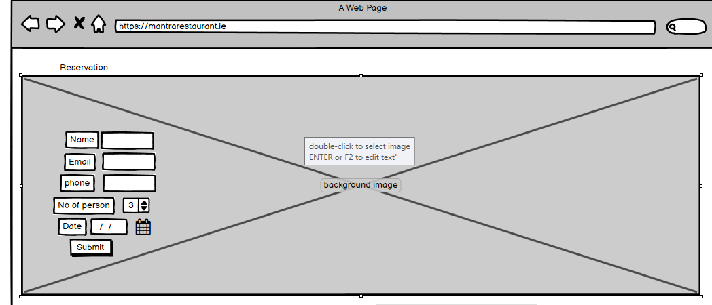
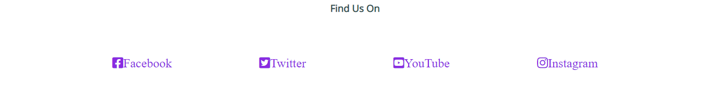
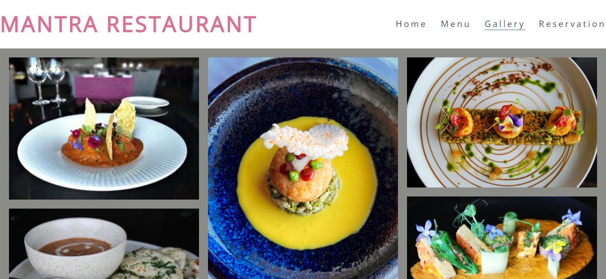
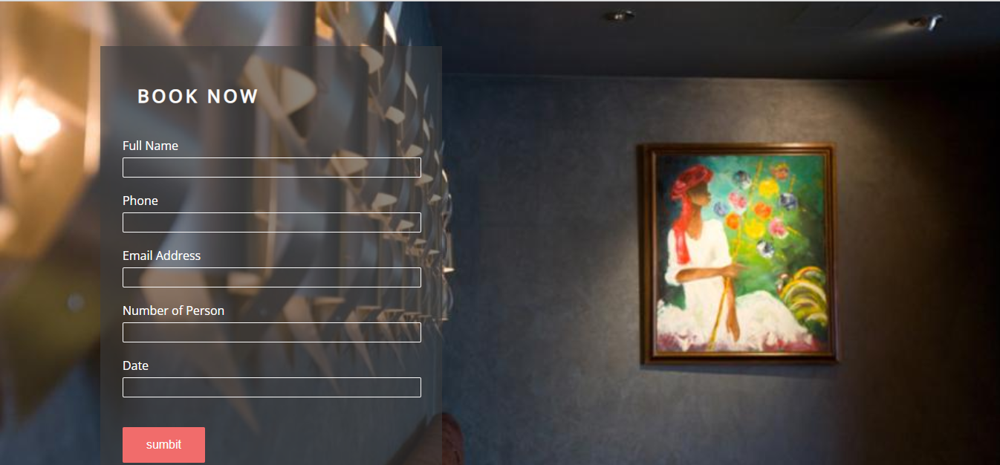

The Mantra Restaurant is home page of fine dinning Nepalese restaurant in Rathcoole dublin, serving food for local residence since 2001. Mantra offers authentic Nepalese cuisine with Irish ingredients.

This website users will get all the neccessary information about Mantra Restaurant including opening hours, location, menu, reservation and gallary. 

<h2>Table of Contents</h2>

<ul>
<li>User experience Design(UX)</li>
<ul>
<li>Strategy Plane</li>
<li>Scope Plan</li>
<li>Structure Plane</li>
<li>Skeleton Plane</li>
<li>Surface Plane</li>
</ul>
<li>Features</li>
<li>Future Enhancement</li>
<li>Performance Testing</li>
<li>Deployment</li>
<li>Credits</li>
</ul>

<h2>User Experience Design</h2>

<ul>
<li>Strategy Plane</li>
<ul>
<li>This website design should provide information about Mantra Restauant information to the users. clean and user friendly pages are helpful to understand.</li></ul>
</ul>
<ul>
<li>Scope Plan</li>
<ul>
<li>This website should work across all browers such as chrome, safari, firefox and edge.</li>
<li>Navigation should be fully funtional to help users.</li>
<li>This website shuold be fully funtional in all mode of screen.</li></ul></ul>

<ul>
<li>Structure Plane</li>
<ul>
<li>The website should be clean, elegant color layout, all ages user friendly. </li>
<li>User should be able to submit their details at the time of booking.</li>
<li>User would be able to navigate with keyboards.</li></ul>
</ul>

<ul>
<li>Skeleton Plane</li>
<ul>

<li>I used baslamic wireframe to designed this website.</li>
<li> On the home page restaurant brand name is visible, all the navigation keys are on the top right handside. </li>

<li>Mantra experience pages would be with image at centre followed by about, cuisine, experiecnce etc.</li>

<li> Map and location provided to guide our customer to the restaurant.</li>
<li>Social media links are provided to engage customer for new menus, events and about updates.</li>

<li>Menu pages would be easy to reade and understandable.</li>

<li>High resoultion photos to be added to inform user about our food and hope to attrat more new customer.</li>

<li>Our website reservation page is user friendly, clean and elegance.</li>
</ul></ul>

<ul>
<li>Surface Design</li>
<ul>
<li>Nice and attractive hero image would be added.</li>
<li>light cover text added with the mantra brand name.</li>
<li>final outcome of the website design is satisfactory.</li></ul></ul>
<h2>Features:</h2>

<ul>
<li>Navigation
  <ul>
    <li>Restaurant Name on left side of the website.</li>
    <li>The navigation links are home, menu, gallary and reservation on right side top right side on website.</li>
    <li> Website navigation clearly helps to understand name of the restaurant and information about different sections.</li>
</ul>
</li>
</ul>

<ul>
<li>Heading</li>
<ul>
<li>Heading  demonstrate the brand of the institiution and easy to recognize.</li>
<li>it describe a restaurant name and easy to read. </li>
</ul>
</ul>

<ul>
<li>Map and Opening Hours</li>
<ul>
<li>User can search our restauration location through provided location map on website.</li>
<li>user can see restaurant opening hours, location, and contact us section on website .</li></ul>
</ul>

<ul>
<li>Find us on</li>
<ul>
<li>At footer section on the website user can see social media links from where our customer can get regualr updates about menus and speical events.</li>
<li>we have designed specific social media icons which is easy to understand.</li>
</ul>
</ul>

<ul>
<li>Gallary</li>
<ul>
<li>Our user and customer can see our food images through our gallary section.</li>
<li>user can experience high resolution images with highly elevated Nepalese cuisine.</li>
</ul>
</ul>

<ul>
<li>Reservation</li>
<ul>
<li>Our user can see clean and user friendly booking system.</li>
<li>user can submit their details with full name, phone number, email, number of person and date of intended booking.</li>
</ul>
</ul>

<h2>Future Enhancement</h2>

<ul>
<li>CSS flexbox would be use to arrange gallary section images.</li>
<li>Online takeaway service would be added.</li>
<li>Menu section would be design with attractive images.</li></ul>
<h2>Performance/Testing</h2>

<ul>
<li>This pages tested in different browers such as chrome, firefox, safari and ms egde and working perfectly fine.</li>
<li>pages are clear, good looking and user friendly.</li>
<li>form section is userfriendly and all section required requested information to complete booking system.</li>
</ul>

<h2>Deployment</h2>

<ul>
<li>This pages are deployed in git hub pages and published </li>
<li> site link : https://neerojstha.github.io/Mantra-Restaurant/index.html</li>
</ul>

<h2>Credits</h2>

<ul>
<li>This pages html and css codes are inspired from love running project.</li>
<li>Photos are received from pexel, unsplash and google images. </li>
<li>Special thanks to my mentor Rahul Lakhanpal for mentoring me during this project.</li></ul>
